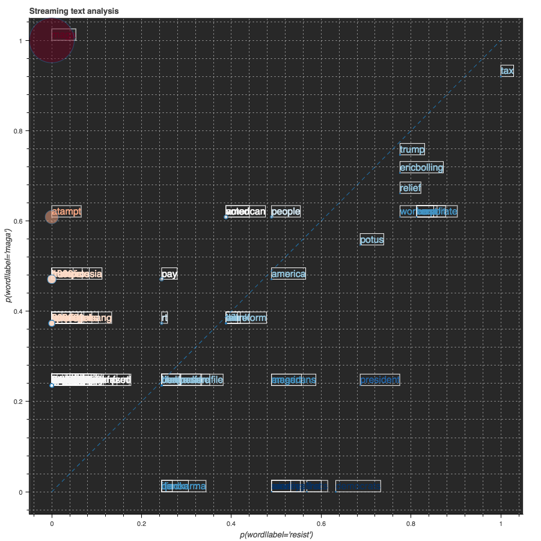

# Run the code with Docker container
If you want to run the Jupyter notebooks using Docker container, you can download this repository onto your local machine. And run `$docker run -it -v yourPathToDownloadedFolder:/home/jovyan -p 8888:8888 xianlai/spark_project`. Then it will map the folder onto the container and you can access the files inside container.

# Project Outline

## Create a Twitter Stream and send tweets to Spark
We set up the Spark context in local mode with 3 CPU's running simulating 3 different machines. And build a Spark streaming context based on Spark context and set the time interval to 5 seconds. So the incoming tweets will be collect into 1 RDD every 5 seconds.
```python
conf = SparkConf().setMaster('local[3]')
sc   = SparkContext(conf=conf)
ssc  = StreamingContext(sc, 5)
```

We build an app called TweetRead.py to pull tweet streaming from Twitter by using library called Tweepy and use socket to send streaming into Spark Streaming

```python
host = "localhost"      # Get local machine name
port = 5555             # Reserve a port for your service.
s = socket.socket()     # Create a socket object
s.bind((host, port))    # Bind to the port
s.listen(5)             # Now wait for client connection.
c, addr = s.accept()    # Establish connection with client.
```
We use Streaming Context API socketTextStream to receive tweet Streaming through port and transfer into Dstreaming, which is the Streaming of RDD
```python
raw_tweets = ssc.socketTextStream('localhost',5555)
```

## Clean Tweets

The tweets come in as a DStream object, which can be thought of as a list of strings, each one corresponding to a single tweet.
```python
raw_tweets = ssc.socketTextStream('172.17.0.2',5555)
```
Next, the `raw_tweets` are written out to a log file to be accessed for any future analysis.
```python
def writeRDD(rdd):
    global logs
    logs.write(timeHeader())
    logs.write("\nRaw Tweets:\n{}".format(rdd.take(num=1)))
    logs.flush()
raw_tweets.foreachRDD(writeRDD)
```

The following line pre-processes the incoming tweets by applying an operation to each RDD in the DStream:
1. Split the string by whitespace
```
clean_tweets = raw_tweets\
   .map(lambda x: x.split())\
   ```
2. Regualar expression to remove any non-alphanumeric characters
```
  .map(lambda x: [re.sub(r'([^\s\w]|_)+', '', y) for y in x])\
```
3. Ensure all words are lower case
```
  .map(lambda x: [word.lower() for word in x])\
```
4. Remove any empty string
```
  .map(lambda x: [word for word in x if word != ''])\
```
5. Filter any words included in STOPWORDS, a file loaded during initialization
```
  .map(lambda x: [word for word in x if word not in STOPWORDS])\
```
6. If any tweets are empty now, remove them:
```
  .filter(lambda x: x != [])\
```
7. Assign label to each tweets
```
  .map(assign_label)\
```
8. Remove tweets that don't belong to any label
```
  .filter(lambda x: x != None)
```
    
The `assign_label` function used above is defined as follows:

```python
def assign_label(words):
    """ Assign labels to tweets. If this tweet has word resist in it, 
    then we assign label resist to it. Else if it has word maga, we 
    label it as maga. If it doesn't have either words, we return none.
    In the same time we remove the label word from the words.
    
    Inputs: words: one tweet in form of a list of cleaned words.
    Output: labeled tweet: (label, words)
    """
    if 'resist' in words:
        words = [x for x in words if x != 'resist']
        return('resist', words)
    if 'maga' in words:
        words = [x for x in words if x != 'maga']
        return('maga', words)
```
        
This takes as input a tweet word list, and outputs a tuple of ('resist', tweet_word_list) if  'resist is contained inside the tweet, and returns ('maga', tweet_word_list) if 'maga' is contained within the tweet.

The final output is be a DStream containing tuples of structure (label, [tweet words])

  
## Extract Feature Words

## Calculate Informativeness of Features

## Visualization

The TweetsStreamingPlot.py file defines the streaming plotting class. We will import this file and use it to initialize an object called `plot` and make streaming plot with method `plot.start(data)`. It will take the data input as a new column data source and push the updated plotting onto the Jupyter notebook.


---

# Project Contributors:
#### [Caleb Hulburt](https://github.com/cmhulbert)
#### [Mohammad Azim](https://github.com/moazim1993)
#### [Xian Lai](https://github.com/Xianlai)
#### [Yao Jin](https://github.com/jinyaohh)


Group Project for Big Data Programming, Fall 2017

Project master repository: 
[Master Branch](<https://github.com/Xianlai/BigData_Spark>)
