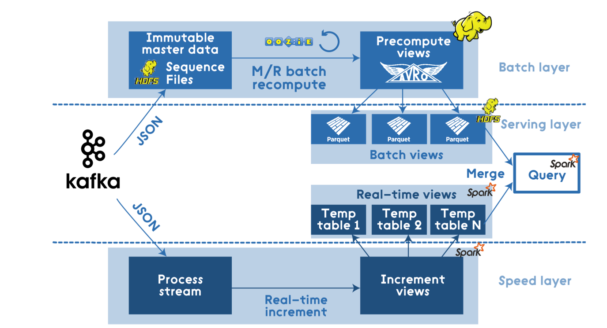
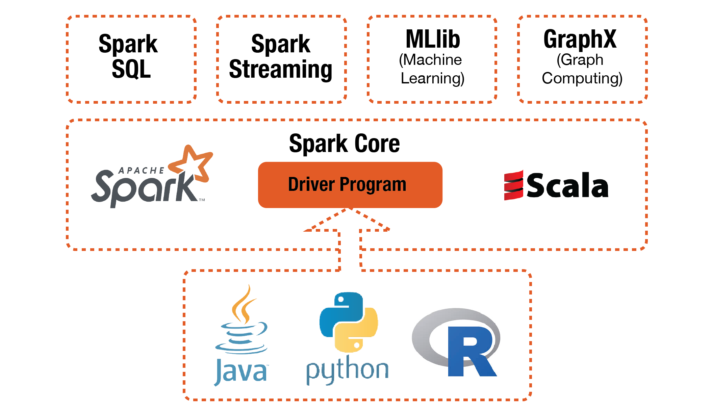

# What is Apache Spark

In big picture perspective, Apache Spark can be considered as an all in one package Lambda Architecture solution.

***Batch layer:***
-	Spark Core that includes high-level API and an optimized engine that supports general execution graphs.

***Serving Layer:***
-	Spark SQL for SQL and structured data processing.

***Speed Layer:***
-	Spark Streaming that enables scalable, high-throughput, fault-tolerant stream processing of live data streams.

Batch processing using Spark might be quite expensive and will not fit for all scenarios and data volumes, but the easy integration with the Hadoop Ecosystem allow it to generalize into more use cases.

#### Example of a Lambda Architecture with Spark



[Read More](https://dzone.com/articles/lambda-architecture-with-apache-spark)


## History

Apache Spark was first developed in 2009 by AMPLab at UC Berkeley as a research project. It started with the creation of Mesos (a cluster management tool) and wanting a system to be built on top of it by some of the original developers lead by Ion Stoica (UC Berkley Professor, and CEO of DataBricks). Requirements for Machine Learning on top of Hadoop was being introduced by the University, and many near-by tech companies, including Stoica’s company Conviva, had required interactive fast querying abilities. It was first released at May 30th, 2014 (only 3 years ago) and later donated to the Apache Software Foundation which has maintained it ever since.

[Interview with Ion Stoica](http://blog.madhukaraphatak.com/history-of-spark/)

## Functionalities

It is an open-source, fault-tolerant batch-computing framework like Hadoop. It provides us several APIs to manipulate a special kind of datasets called RDD (Resilient Distributed Dataset), a distributed memory abstraction that lets programmers perform in-memory computations on large clusters in a fault-tolerant manner. RDDs were motivated by the needs for iterative algorithms and interactive data mining tools. In both cases, keeping data in memory can improve performance by an order of magnitude.


---
Spark Core is the foundational component:

- **Spark Core**
 
Spark Core provides distributed task dispatching, scheduling, basic I/O etc. All these functionalities are exposed through an application programming interface (for Java, Python, Scala, and R) called driver program. We tell the driver program what we want to do by passing a function. And it calls the Spark Core to do the low-level jobs for us.

Built on top of the Spark Core, Spark provide 4 higher-level libraries for special purpose jobs:

- **Spark SQL**
 
Spark SQL provides a data abstraction called DataFrames that support both structured or semi-structured data. 

- **Spark Streaming**
 
Spark Streaming is used for steaming analysis because of the speed of computation.

- **MLlib**
 
MLlib is used for machine learning jobs. Specifically, it includes following machine learning techniques and models:
    - Statistics like correlations, stratified sampling, hypothesis testing, random data generation.
    - Classificationa and Regression like SVM, logistic regression, linear regression, decisoon tree, naive Bayes.
    - Collaborativbe Filtering like alternating least squares
    - Cluster Analysis like kmeans and Latent Dirichletian Allocation
    - Dimension Reduction like SVD and PCA
    - Feature Extraction and Transformation
    - Optimization like SGD, L-BFGS.

- **GraphX**
 
GraphX is used for graph processing like PageRank and so on.

---

# What is special about Spark

All we do with data can be generalized as applying some operations on some dataset. Spark is designed in this way too.

## RDD
The special kind of datasets in Spark--**Resilient Distributed Datasets(RDDs)**--form the foundation of Spark. Basically, an RDD is a collection of tuples. What is special about RDD is that you can keep it in memories of machines by using ``persist()`` or ``cache()`` method. On addition to that, you can specify the storage level to control how it is saved. 

By default, Spark saves the RDD as de-serialized Java objects in memory. And if the RDD is too big, the part that doesn't fit will not be cached and will be recomputed on the fly every time they are needed. (For the full set of storage levels and their details, check [here.](https://spark.apache.org/docs/latest/rdd-programming-guide.html#rdd-persistence))

This is the key difference between Spark and Hadoop. Because as we know, Hadoop dose not save any output in memory, even the intermediate key/value pairs coming out of map function are saved to local disk and being retrieved by reducer. The serialization/deserialization during I/O make the process very inefficient if we need to use the same dataset from time to time. (Think about tuning models in Machine Learning.) In contrast, the RDDs used in Spark can stay in memory thus allows up to use them iteratively and interactively repeatedly without having to read them from disk.

## Operations:
The operations to manipulate RDD in Spark are high level and flexible. It is high-level because it saves us from disk I/Os and provide a variety of high-level operations like JCascalog and other libraries for Hadoop. It is flexible because lots of the operations work with custom functions implemented for specific purpose by ourselves. In general, the operations are categorized into transformations and actions:

- **Transformations: all the operations take in RDD and return a new RDD are considered transformations.** Below are some of them:

    | Transformation | Meaning |
    | --- | --- |
    | map(function) | use the input function to process each row of RDD and return a new processed RDD|
    | filter(function) | use the input function to evaluate each row of RDD and remove the rows evaluated false |
    | union(otherDataset) | return the union of 2 data sets based on identical fields |
    | reduceByKey(function, [numTasks]) | return a new RDD in which values of same key are aggregated |
    | ... | ...|

- **Actions: all the operations take in RDD and return something that is not RDD are considered actions.** For example:

    | Actions | Meaning |
    | --- | --- |
    | reduce(function) | aggregate the elements of RDD using provided function|
    | collect() | return all the elements in RDD as an array |
    | rake(n) | return the elements of first n rows in RDD as an array |
    | saveAsSequenceFile(path) | with the elements of the dataset as a Hadoop SequenceFile in a given path in local filesystem |
    | ... | ...|

For more operations and details, check -> [https://spark.apache.org/docs/latest/rdd-programming-guide.html#transformations](https://spark.apache.org/docs/latest/rdd-programming-guide.html#transformations)

On addition to these basic, one-step type of operations, Spark offers more complex operations in those 4 specific purpose libraries we talked about in last section. And these complex operations are nothing more than a combination of basic operations.

# When should we use it
As we said, the main advantage of Spark is the RDD. It's fast for iterative algorithm and interactive developing environment. And it's convenient to use those 4 specific purpose libraries if they suit our needs.

### References
Apache Spark Documentation: [(https://spark.apache.org/docs/latest/index.html)](https://spark.apache.org/docs/latest/index.html)
Wikipedia: Apache Spark: ()
Apache Spark GitHub Repository: [(https://github.com/apache/spark)](https://github.com/apache/spark)

### The Apache spark project
More info: [The Apache Spark Project](https://spark.apache.org/)

---

# Run the code with Docker container
If you want to run the Jupyter notebooks using Docker container, you can download this repository onto your local machine. And run `$docker run -it -v /your/Path/To/Downloaded/Folder:/home/jovyan -p 8888:8888 xianlai/spark_project`. Then it will map the folder onto the container and you can access the files inside container.

# Project Outline

The main project file is contained in the ipython notebook [Tweets_analysis_SparkStreaming.ipynb](./Project/Tweets_analysis_SparkStreaming.ipynb)

In order to receive Tweets, you will need to add your own Twitter API keys in the [TweetsListener.py](./Project/TweetsListener.py) file. The variables that need to be set are are the top and are as follows:
```python
consumer_key    = None  # Replace with your Consumer key
consumer_secret = None  # Replace with your Consumer secret
access_token    = None  # Replace with your acces token
access_secret   = None  # Replace with your access secret
```

## Startup, Twitter Stream, and Send Tweets to Spark
Firstly we use Tweepy API to pull tweets streams containg the words 'MAGA' or 'resist'. 

We built a module called TweetRead.py containing a class to pull tweets streaming from Twitter containging the words 'MAGA' or 'resist' by using the Tweepy API. Then the stream is directed into Spark Streaming through a TCP socket.
```python
host = "172.17.0.2"     # Get local machine name
port = 5555             # Reserve a port for your service.
s = socket.socket()     # Create a socket object
s.bind((host, port))    # Bind to the port
s.listen(5)             # Now wait for client connection.
c, addr = s.accept()    # Establish connection with client.
sendData( c,['maga', 'resist'] )    #Function to start receiving data from Twitter, and send them to Spark
```

We set up the Spark context in local mode with 3 thread's allowing up to 3 simultaneous processes. The Spark streaming context is initialized based on Spark context and set the update time interval to 5 seconds. Thus, incoming tweets will be added to a DStream every 5 seconds.
```python
conf = SparkConf().setMaster('local[3]')
sc   = SparkContext(conf=conf)
ssc  = StreamingContext(sc, 5)
```

On the Spark side we use the Streaming Context method `socketTextStream` to receive tweet Streaming through the previously initialized socket, and transfer into DStream.
```python
raw_tweets = ssc.socketTextStream('localhost',5555)
```

## Clean Tweets

`raw_tweets`, from above, cna be though of as a list of strings, each one corresponding to a single tweet.

First, the `raw_tweets` are written out to a log file to be accessed for any future analysis.
```python
def writeRDD(rdd):
    global logs
    logs.write(timeHeader())
    logs.write("\nRaw Tweets:\n{}".format(rdd.take(num=1)))
    logs.flush()
raw_tweets.foreachRDD(writeRDD)
```

Then, we pre-processes the incoming tweets by applying an operation to each RDD in the DStream:
1. Split the string by whitespace
```
clean_tweets = raw_tweets\
   .map(lambda x: x.split())\
   ```
2. Regualar expression to remove any non-alphanumeric characters
```
  .map(lambda x: [re.sub(r'([^\s\w]|_)+', '', y) for y in x])\
```
3. Ensure all words are lower case
```
  .map(lambda x: [word.lower() for word in x])\
```
4. Remove any empty string
```
  .map(lambda x: [word for word in x if word != ''])\
```
5. Filter any words included in STOPWORDS, a file loaded during initialization
```
  .map(lambda x: [word for word in x if word not in STOPWORDS])\
```
6. If any tweets are empty now, remove them:
```
  .filter(lambda x: x != [])\
```
7. Assign label to each tweets
```
  .map(assign_label)\
```
8. Remove tweets that don't belong to any label
```
  .filter(lambda x: x != None)
```
    
The `assign_label` function used above is defined as follows:

```python
def assign_label(words):
    """ Assign labels to tweets. If this tweet has word resist in it, 
    then we assign label resist to it. Else if it has word maga, we 
    label it as maga. If it doesn't have either words, we return none.
    In the same time we remove the label word from the words.
    
    Inputs: words: one tweet in form of a list of cleaned words.
    Output: labeled tweet: (label, words)
    """
    if 'resist' in words:
        words = [x for x in words if x != 'resist']
        return('resist', words)
    if 'maga' in words:
        words = [x for x in words if x != 'maga']
        return('maga', words)
```
        
This takes as input a tweet word list, and outputs a tuple of ('resist', tweet_word_list) if  'resist is contained inside the tweet, and returns ('maga', tweet_word_list) if 'maga' is contained within the tweet.

The final output is be a DStream containing tuples of structure (label, [tweet words])
  
## Extract Feature Words
The first step of extracting features requires a simple count of the tweets for each label and a `flatMapValues()`.
the n_maga and n_resist is a simple int count of tweets of each label.
The `flatMapValues()` pass each value in the key-value pair RDD through a flatMap function without changing the keys; this also retains the original RDD's partitioning.
Example use
```python
x = sc.parallelize([("a", ["x", "y", "z"]), ("b", ["p", "r"])])
 def f(x): return x
 x.flatMapValues(f).collect()

[('a', 'x'), ('a', 'y'), ('a', 'z'), ('b', 'p'), ('b', 'r')]
```

We first need to calculate the number of tweets with each label, using the `count_by_label` function. This function filters the initial RDD based on whether the label for each tuple is 'maga' or 'resist'. It then returns a flatMaps the RDD, and logs the output before continuing.
```python
def count_by_label(rdd):
    """ count the number of tweets by label
    """
    global logs
    
    # count the number of maga tweets
    # count the number of resist tweets
    # flatten the words so that each row is (label, word)
    n_maga   = float(rdd.filter(lambda x: x[0] == 'maga').count())
    n_resist = float(rdd.filter(lambda x: x[0] == 'resist').count())
    new_rdd  = rdd.flatMapValues(lambda x: x)
    
    logs.write('\n# Resist Tweets: {}\t # MAGA Tweets: {}'\
        .format(int(n_resist), int(n_maga)))
    logs.flush()
    
    return new_rdd, n_resist, n_maga
```

```python
new_rdd, n_resist, n_maga = count_by_label(rdd)
```

Next, we fetch the features extracted in the above step, using the `fetch_features` function. This function reduces the RDD returned from `count_by_label` by the each tweet's label. It maps all features within each label to a count tuple, such as feature -> (feature, 1). These tuples are then reduced by key, to return a tuple containing (feature, count). Then, these are mapped to a nested tuple, consisting of (label, (feature, count))

We then take the top 5000 features within each label, by count. These features are considered to have high enough frequency to calculate informativeness. 

```python
def fetch_features(rdd):
    """ fetch top 5000 features for each label
    """
    global logs
    
    # input rdd has rows: (label, word)
    # use the label and word as key as add count 1: ((label, word), 1)
    # add up the count: ((label, word), count)
    # reorganize: (label, (word, count))
    new_rdd = rdd.map(lambda x: (x, 1))\
        .reduceByKey(lambda a, b: a+b)\
        .map(lambda x: (x[0][0], (x[0][1], x[1])))\
        
    # maga features are top 5000 words with highest count
    m_feats = new_rdd.filter(lambda x: x[0] == 'maga')\
        .takeOrdered(5000, key = lambda x: -x[1][1])
    # resist features are top 5000 words with highest count
    r_feats = new_rdd.filter(lambda x: x[0] == 'resist')\
        .takeOrdered(5000, key = lambda x: -x[1][1])
    
    logs.write("\nMAGA features:\n{}".format(m_feats[:10]))
    logs.write("\nresist features:\n{}".format(r_feats[:10]))
    logs.flush()
    
    return m_feats, r_feats

maga_feats, resist_feats = fetch_features(new_rdd)
```

Next, we use the `collect_feature_counts` to create a dictionary to hold the feature words for each label.
`words` is a dictionary of the form `words = {'m': [list of maga features], 'r': [list of resist features]}`
`counts` is a nested dictionary, with top level keys 'm' for maga, and 'r' for resist. The values are dictionaries of the form `{feature: count_of_feature_in_label`
```python
def collect_feature_counts(maga_feats, resist_feats):
    """ collect the words for each label as a list.
    collect the word:count for each label as a dictionary.
    """
    words, counts = {}, {}
    # create a dictionary: label:feature_words
    words['m'] = [x[1][0] for x in maga_feats]
    words['r'] = [x[1][0] for x in resist_feats]

    # create a dictionary: label:feature_word_counts
    # feature_word_counts is a dictionary of word:count pairs
    counts['m'] = {x[1][0]:x[1][1] for x in maga_feats}
    counts['r'] = {x[1][0]:x[1][1] for x in resist_feats}

    return words, counts

words, counts = collect_feature_counts(maga_feats, resist_feats)
```

Further, we combine the feature counts by label. This reduces the `counts` by feature, so that each feature is a key, and the value is a tuple of feature frequency in each label. We also filter out any features that have a frequency of 1 in both lists. The returned dictionary is of the form `combined_count[feature] = [frequency_in_maga, frequency_in_resist]`.
```python
def combine_feature_counts(counts):
    """ create a combined dictionary with pairs {word:[count_maga, 
    count_resist]}, for word only appears in one dataset, we will 
    assign 1 as count to avoid zero divide"""
    global logs
    combined_counts = {}
    
    # if a word appears in only maga tweets, we add word:[count_maga, 1]
    # if a word appears in both tweets, we add word:[count_maga, count_resist]
    # if a word appears in only resist tweets, we add word:[1, count_resist]
    for word, count in counts['m'].items():
        if count <= 1: continue
        if word not in counts['r'].keys():
            combined_counts[word] = [count, 1]
        else:
            combined_counts[word] = [count, counts['r'][word]]
    for word, count in counts['r'].items():
        if count <= 1: continue
        if word not in combined_counts.keys():
            combined_counts[word] = [1, count]
            
    
    logs.write("\nCombined feature_counts_by_label: {}".format(list(combined_counts.items())[:10]))
    logs.flush()
    print(list(combined_counts.items()), '\n')
    return combined_counts

combined_counts = combine_feature_counts(counts)
```

## Calculate Informativeness of Features
Informativeness is a measure of how useful a word is in classifcation: it's based on the relative frequency of a word between two class labels. In our case, we started by looking at the frequency of the features extracted from above in both classes of tweets, 'resist' and 'maga'. 

Finally,  we calculate the informative ness from the `combined_counts` dictionary, using the `analysis` function.
First, we use the above functions to get features and counts. Then we run sc.parallellize on the `combined_counts` items, to convert it to a spark RDD.
```python
def analysis(rdd):
    """ Take in the RDD with cleaned tweets and perform analysis. Save the results 
    to logs text file as well as interactive plots.
    """
    # count the number of tweets
    new_rdd, n_resist, n_maga = count_by_label(rdd)
    maga_feats, resist_feats = fetch_features(new_rdd)
    words, counts = collect_feature_counts(maga_feats, resist_feats)
    combined_counts = combine_feature_counts(counts)

    # calculate the informativeness
    infs = sc.parallelize(combined_counts.items())\
        .mapValues(lambda x: (x[0]/n_maga, x[1]/n_resist))\
        .mapValues(lambda x: (log(x[0]), log(x[1]), calculate_informativeness(x)))\
        .sortBy(lambda x: x[1][2], ascending=False)\
        .take(5000)

    plot_data(infs[:100], words)
```
We then calculate the conditional probability of each feature within its label. Conditional probability is calculated as the frequency of a feature within a label, divided by the sum count of all features in that label. We then `calculate_informativeness` function.
```python
def calculate_informativeness(cps):
    """ takes in the conditional probablities of one feature and 
    calculate the informativeness of this feature.
    
    inputs:
    -------
    cps[0]: the conditional probability of this feature word given label maga
    cps[1]: the conditional probability of this feature word given label resist
    """
    return round(max(cps[0]/cps[1], cps[1]/cps[0]), 5)
```
This function returned the max value, when dividing each conditional probability by the other. 

## Visualization

The TweetsStreamingPlot.py file defines the streaming plotting class. We will import this file and use it to initialize an object called `plot` and make streaming plot with method `plot.start(data)`. It will take the data input as a new column data source and push the updated plotting onto the Jupyter notebook.
(..)

---

# Other examples:
Besides the analysis of streaming tweets, we also did some other examples:
1. **Tweets_analysis_spark.ipynb**: Analyze the tweets dataset loading from text file in a non-streaming way.
2. **Spark_machine_learning_pipeline.ipynb**: Build a machine learning classification pipeline using Spark MLlib and apply it on online popularity news dataset.

---

# Installation
[Installation Guide](https://github.com/moazim1993/BigData_Spark_Tutorial/tree/gh-pages/Installation)
Instructions provided in full 

---


# Project Contributors:
#### [Caleb Hulburt](https://github.com/cmhulbert)
#### [Mohammad Azim](https://github.com/moazim1993)
#### [Xian Lai](https://github.com/Xianlai)
#### [Yao Jin](https://github.com/jinyaohh)


Group Project for Big Data Programming, Fall 2017

Project master repository: 
[Master Branch](<https://github.com/Xianlai/BigData_Spark>)
